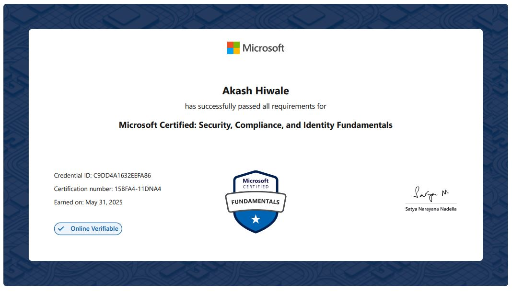

# 🏅 Microsoft Certified: Security, Compliance, and Identity Fundamentals

---

I have officially cleared **Microsoft Certified: Security, Compliance, and Identity Fundamentals (SC-900)** Certification! 🎉

This certification validates my foundational knowledge in:
- Security, compliance, and identity (SCI) concepts
- Microsoft Entra ID and identity principles
- Microsoft security solutions like Defender, Sentinel, and Intune
- Microsoft compliance tools such as Purview and Compliance Manager

---

📅 **Date of Certification:** [31-May-2025]  

---